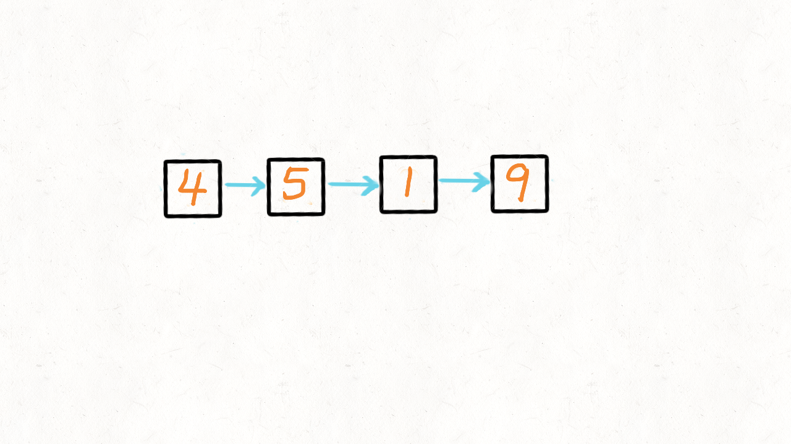

# Navigation
- [Navigation](#navigation)
- [Links:](#links)
- [Solution 1 偷梁换柱](#solution-1-偷梁换柱)


# Links:
1. https://leetcode.com/problems/delete-node-in-a-linked-list/
2. https://leetcode-cn.com/problems/delete-node-in-a-linked-list/


# Solution 1 偷梁换柱
要认真申题。限制有二：
1. 只给定要求被删除的节点。就是从删除的节点开始。
2. 删除的节点不是列表的末尾节点。
思路：
一般删除链表的节点要一个前驱节点。没有咋办。用后一个节点的值覆盖并且改变当前节点的指针。s


```python
# Definition for singly-linked list.
# class ListNode(object):
#     def __init__(self, x):
#         self.val = x
#         self.next = None

class Solution(object):
    def deleteNode(self, node):
        """
        :type node: ListNode
        :rtype: void Do not return anything, modify node in-place instead.
        """
        node.val = node.next.val
        node.next = node.next.next
```
---
Go
```go
package main

/**
 * Definition for singly-linked list.
 * type ListNode struct {
 *     Val int
 *     Next *ListNode
 * }
 */
func deleteNode(node *ListNode) {
	node.Val = node.Next.Val
	node.Next = node.Next.Next
}

```