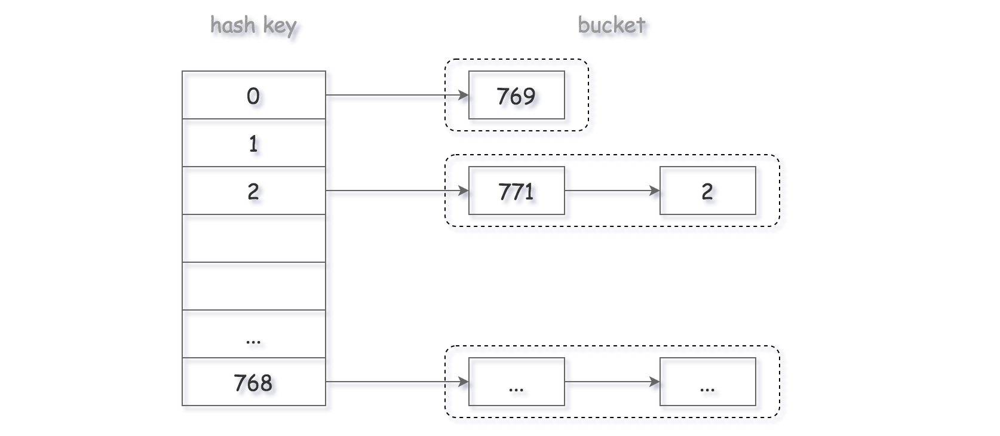
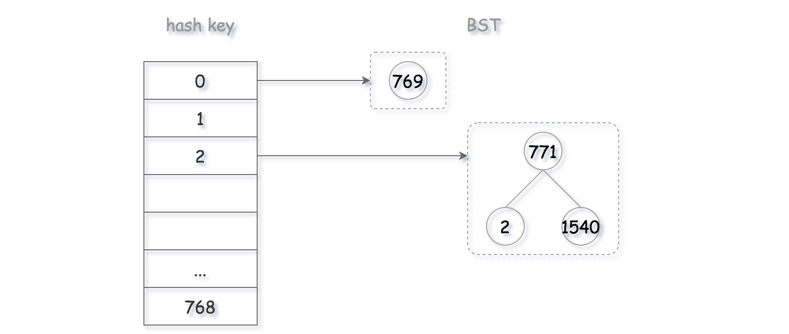

# Navigation
- [Navigation](#navigation)
- [Links](#links)
- [要点](#%e8%a6%81%e7%82%b9)
- [Solution 1 使用链表作为桶（Separate chaining with linked lists）](#solution-1-%e4%bd%bf%e7%94%a8%e9%93%be%e8%a1%a8%e4%bd%9c%e4%b8%ba%e6%a1%b6separate-chaining-with-linked-lists)
- [Solution 2 使用二叉搜索树作为桶](#solution-2-%e4%bd%bf%e7%94%a8%e4%ba%8c%e5%8f%89%e6%90%9c%e7%b4%a2%e6%a0%91%e4%bd%9c%e4%b8%ba%e6%a1%b6)

# Links
1. https://leetcode.com/problems/design-hashset/
2. https://leetcode-cn.com/problems/design-hashset/


# 要点
> 为了实现 HashSet 数据结构，有两个关键的问题，即哈希函数和冲突处理。
> 哈希函数：目的是分配一个地址存储值。理想情况下，每个值都应该有一个对应唯一的散列值。（最简单的是mod运算）
> 冲突处理：哈希函数的本质就是从 A 映射到 B。但是多个 A 值可能映射到相同的 B。这就是碰撞。因此，我们需要有对应的策略来解决碰撞。总的来说，有以下几种策略解决冲突：
> 单独链接法：对于相同的散列值，我们将它们放到一个桶中，每个桶（一般是链表）是相互独立的。
> 开放地址法：每当有碰撞， 则根据我们探查的策略找到一个空的槽为止。
> 双散列法：使用两个哈希函数计算散列值，选择碰撞更少的地址。
解决冲突方法详情看[Wiki](https://en.wikipedia.org/wiki/Hash_table#Collision_resolution)

# Solution 1 使用链表作为桶（Separate chaining with linked lists）
1. hash函数映射到链表而不是一个数。即HashSet是一个数组，每个元素是一个链表。
2. hash函数选择最简单的mod元算，hash = value mod base。base选择一个质数769。



```python
class MyHashSet:

    def __init__(self):
        """
        Initialize your data structure here.
        """
        self.key_range = 769
        self.bucket_array = [Bucket() for i in range(self.key_range)]

    def _hash(self, key):
        return key % self.key_range

    def add(self, key):
        """
        :type key: int
        :rtype: None
        """
        bucket_index = self._hash(key)
        self.bucket_array[bucket_index].insert(key)

    def remove(self, key):
        """
        :type key: int
        :rtype: None
        """
        bucket_index = self._hash(key)
        self.bucket_array[bucket_index].delete(key)

    def contains(self, key):
        """
        Returns true if this set contains the specified element
        :type key: int
        :rtype: bool
        """
        bucket_index = self._hash(key)
        return self.bucket_array[bucket_index].exists(key)


class Node:
    def __init__(self, value, next_node=None):
        self.value = value
        self.next = next_node

class Bucket:
    """
        此处的实现是链表。
    """
    def __init__(self):
        # a pseudo head
        self.head = Node(0)

    def insert(self, value):
        # 头插法
        # if not existed, add the new element to the head.
        if not self.exists(value):
            new_node = Node(value, self.head.next)
            # set the new head.
            self.head.next = new_node

    def delete(self, value):
        # 删除要找到前驱节点
        prev = self.head
        curr = self.head.next
        while curr:
            if curr.value == value:
                # remove the current node
                prev.next = curr.next
                return
            prev = curr
            curr = curr.next

    def exists(self, value):
        curr = self.head.next
        while curr:
            if curr.value == value:
                # value existed already, do nothing
                return True
            curr = curr.next
        return False
```

# Solution 2 使用二叉搜索树作为桶
参考[Wiki](https://en.wikipedia.org/wiki/Hash_table#Separate_chaining_with_other_structures)

1. Solution 1的链表的查找操作都是O(N)。
2. 二分查找是O(logN)，但是使用排序列表要额外的时间复杂度。
3. 所以，使用二叉搜索树。查找、删除、插入都是O(logN)。



```python
class MyHashSet:

    def __init__(self):
        """
        Initialize your data structure here.
        """
        self.key_range = 769
        self.bucket_array = [Bucket() for i in range(self.key_range)]

    def _hash(self, key) -> int:
        return key % self.key_range

    def add(self, key: int) -> None:
        bucket_index = self._hash(key)
        self.bucket_array[bucket_index].insert(key)

    def remove(self, key: int) -> None:
        bucket_index = self._hash(key)
        self.bucket_array[bucket_index].delete(key)

    def contains(self, key: int) -> bool:
        bucket_index = self._hash(key)
        return self.bucket_array[bucket_index].exists(key)


class Bucket:
    def __init__(self):
        self.tree = BSTree()

    def insert(self, value):
        self.tree.root = self.tree.insert(self.tree.root, value)

    def delete(self, value):
        self.tree.root = self.tree.delete(self.tree.root, value)

    def exists(self, value):
        return True if self.tree.search(self.tree.root, value) else False


class TreeNode:
    def __init__(self, value):
        self.val = value
        self.left = None
        self.right = None


class BSTree:
    def __init__(self):
        self.root = None

    def search(self, root: TreeNode, val: int) -> TreeNode:
        if not root or val == root.val:
            return root

        return self.search(root.left, val) if val < root.val \
            else self.search(root.right, val)

    def insert(self, root: TreeNode, val: int) -> TreeNode:
        if not root:
            return TreeNode(val)

        if val == root.val:
            return root
        elif val > root.val:
            # insert into the right subtree
            root.right = self.insert(root.right, val)
        else:
            # insert into the left subtree
            root.left = self.insert(root.left, val)
        return root

    def successor(self, root):
        """
        One step right and then always left
        """
        root = root.right
        while root.left:
            root = root.left
        return root.val

    def predecessor(self, root):
        """
        One step left and then always right
        """
        root = root.left
        while root.right:
            root = root.right
        return root.val

    def delete(self, root: TreeNode, key: int) -> TreeNode:
        if not root:
            return None

        # delete from the right subtree
        if key > root.val:
            root.right = self.delete(root.right, key)
        # delete from the left subtree
        elif key < root.val:
            root.left = self.delete(root.left, key)
        # delete the current node
        else:
            # the node is a leaf
            if not (root.left or root.right):
                root = None
            # the node is not a leaf and has a right child
            elif root.right:
                root.val = self.successor(root)
                root.right = self.delete(root.right, root.val)
            # the node is not a leaf, has no right child, and has a left child
            else:
                root.val = self.predecessor(root)
                root.left = self.delete(root.left, root.val)

        return root

```