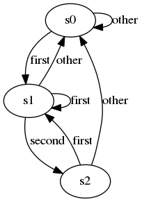

# Navigation
- [Navigation](#navigation)
- [Links](#links)
- [Solution 1 顺序遍历](#solution-1-%e9%a1%ba%e5%ba%8f%e9%81%8d%e5%8e%86)
- [Solution 2 状态机](#solution-2-%e7%8a%b6%e6%80%81%e6%9c%ba)

# Links
1. https://leetcode.com/problems/occurrences-after-bigram/
2. https://leetcode-cn.com/problems/occurrences-after-bigram/


# Solution 1 顺序遍历
```python
class Solution:
    def findOcurrences(self, text: str, first: str, second: str) -> List[str]:
        result = []
        text = text.split(' ')

        for i in range(len(text) - 2):
            if text[i] == first and text[i + 1] == second:
                result.append(text[i + 2])
        
        return result
```

# Solution 2 状态机

```python
class Solution:
    def findOcurrences(self, text: str, first: str, second: str) -> List[str]:
        result = []
        f, s = False, False   # the first state, the second state

        for t in text.split(' '):
            if f and s:
                result.append(t)
                f, s = False, False
            
            if t == first:
                f, s = True, False
            elif t == second:
                s = f and True
            else:
                f, s = False, False

        return result
```