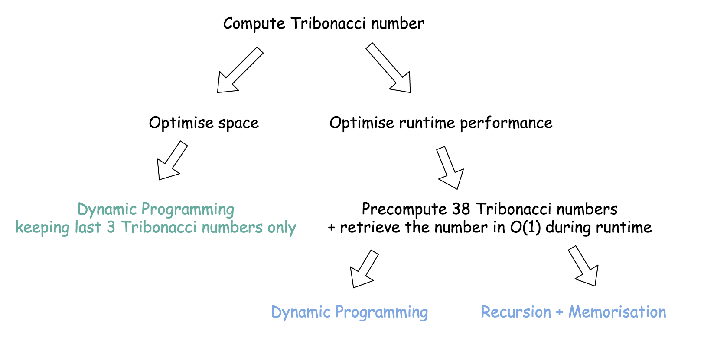

# Navigation
- [Navigation](#navigation)
- [Links](#links)
- [思路](#%e6%80%9d%e8%b7%af)
- [Solution 1 空间优化：DP。在内存中保留不超过 3 个斐波那契数](#solution-1-%e7%a9%ba%e9%97%b4%e4%bc%98%e5%8c%96dp%e5%9c%a8%e5%86%85%e5%ad%98%e4%b8%ad%e4%bf%9d%e7%95%99%e4%b8%8d%e8%b6%85%e8%bf%87-3-%e4%b8%aa%e6%96%90%e6%b3%a2%e9%82%a3%e5%a5%91%e6%95%b0)
- [Solution 2 性能优化：DP。递归 +　memo](#solution-2-%e6%80%a7%e8%83%bd%e4%bc%98%e5%8c%96dp%e9%80%92%e5%bd%92--memo)
- [Solution 3 性能优化：DP。不递归 + memo](#solution-3-%e6%80%a7%e8%83%bd%e4%bc%98%e5%8c%96dp%e4%b8%8d%e9%80%92%e5%bd%92--memo)

# Links
1. https://leetcode.com/problems/n-th-tribonacci-number/
2. https://leetcode-cn.com/problems/n-th-tribonacci-number/

# 思路
两种方法：性能优化，一种是空间优化。


# Solution 1 空间优化：DP。在内存中保留不超过 3 个斐波那契数
```
    时间复杂度：O(N)
    空间复杂度：O(1)
```
```python
class Solution:
    def tribonacci(self, n):
        if n < 3:
            return 1 if n else 0

        x, y, z = 0, 1, 1

        for _ in range(n - 2):
            x, y, z = y, z, x + y + z

        return z
```

# Solution 2 性能优化：DP。递归 +　memo
```python
class Tri:
    def __init__(self):
        n = 38
        self.nums = [0 for _ in range(n)]
        self.nums[1] = self.nums[2] = 1
        self.helper(n - 1)

    def helper(self, n):
        if n == 0:
            return 0

        if self.nums[n]:
            return self.nums[n]

        self.nums[n] = self.helper(n - 1) + self.helper(n - 2) + self.helper(n - 3)
        return self.nums[n]


class Solution:
    memo = Tri()
    
    def tribonacci(self, n):
        return self.memo.nums[n]
```

# Solution 3 性能优化：DP。不递归 + memo
```python
class Tri:
    def __init__(self):
        n = 38
        self.nums = [0 for _ in range(n)]
        self.nums[1] = self.nums[2] = 1
        
        for i in range(3, n):
            self.nums[i] = self.nums[i - 1] + self.nums[i - 2] + self.nums[i - 3]


class Solution:
    memo = Tri()

    def tribonacci(self, n):
        return self.memo.nums[n]
```