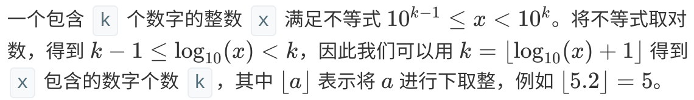

# Navigation
- [Navigation](#navigation)
- [Links](#links)
- [Solution 1 转换为str](#solution-1-%e8%bd%ac%e6%8d%a2%e4%b8%bastr)
- [Solution 2 数学](#solution-2-%e6%95%b0%e5%ad%a6)

# Links
1. https://leetcode.com/problems/find-numbers-with-even-number-of-digits/
2. https://leetcode-cn.com/problems/find-numbers-with-even-number-of-digits/


# Solution 1 转换为str
```python
class Solution:
    def findNumbers(self, nums: List[int]) -> int:
        nums_len = map(len, map(str, nums))

        return sum(length % 2 == 0 for length in nums_len)
```
---
```python
class Solution:
    def findNumbers(self, nums: List[int]) -> int:
        return sum(1 for num in nums if len(str(num)) % 2 == 0)
```

# Solution 2 数学

```python
import math


class Solution:
    def findNumbers(self, nums: List[int]) -> int:
        return sum(1 for num in nums if int(math.log10(num) + 1) % 2 == 0)
```