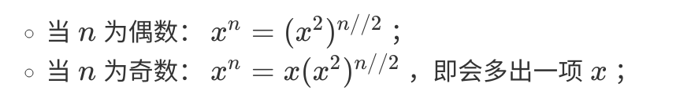
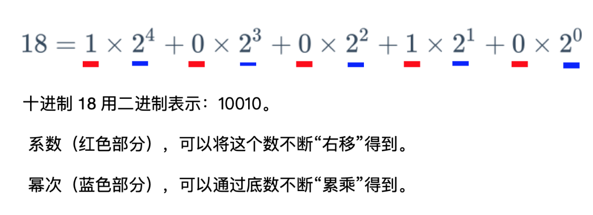

# Navigation
- [Navigation](#navigation)
- [Links](#links)
- [Solution 1 递归（分治），数学角度](#solution-1-%e9%80%92%e5%bd%92%e5%88%86%e6%b2%bb%e6%95%b0%e5%ad%a6%e8%a7%92%e5%ba%a6)
- [Solution 2 迭代，二进制角度](#solution-2-%e8%bf%ad%e4%bb%a3%e4%ba%8c%e8%bf%9b%e5%88%b6%e8%a7%92%e5%ba%a6)

# Links
1. https://leetcode-cn.com/problems/shu-zhi-de-zheng-shu-ci-fang-lcof/

# Solution 1 递归（分治），数学角度
循环x = x ** 2，每次把幂降到n == n // 2，直到n == 0。

通俗地说，2 * 2 -> 4，不进行4 * 2 -> 8，8 * 2 -> 16，而是4 * 4 -> 16。这样可以减少计算次数。
```
    时间复杂度：O(logN)。base为2。N的二进制位数。
    空间复杂度：O(logN)。系统栈
```
```python
class Solution:
    def myPow(self, x: float, n: int) -> float:
        if n == 0:
            return 1
        
        if n < 0:
            return 1 / self.myPow(x, -n)

        if n & 1:   # 如果是奇数
            return x * self.myPow(x, n - 1)

        return self.myPow(x * x, n // 2)
```

# Solution 2 迭代，二进制角度
```
    时间复杂度：O(logN)。base为2
    空间复杂度：O(1)
```
> 把指数 n 做“二进制分解”，在底数不断自身乘以自身的过程中，将最终结果需要的部分保存下来。
引用：https://leetcode-cn.com/u/liweiwei1419/
 
```python
class Solution:
    def myPow(self, x: float, n: int) -> float:
        if n < 0:
            x = 1 / x
            n = -n
        
        res = 1
        while n:
            if n & 1:   
                res *= x
            
            x *= x
            n >>= 1 # n //= 2

        return res
```