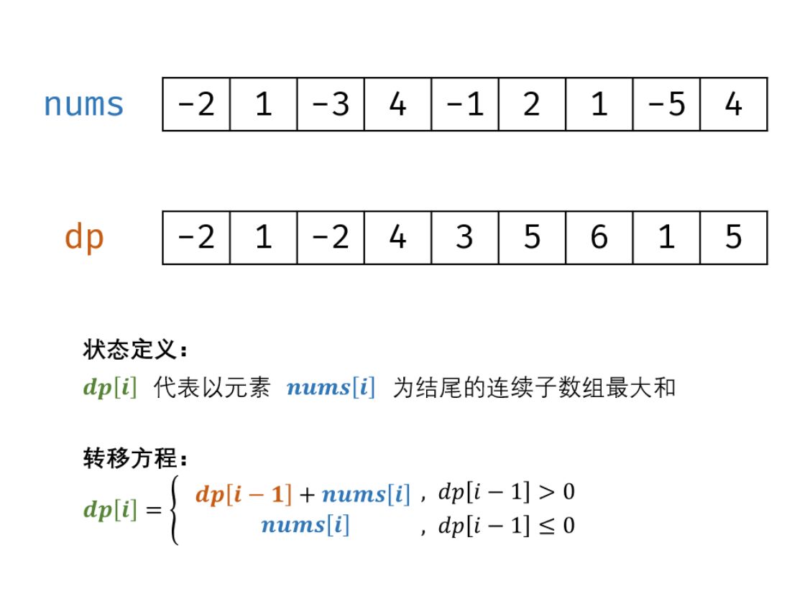

# Navigation
- [Navigation](#navigation)
- [Links](#links)
- [Solution 1 动态规划 + 贪心](#solution-1-动态规划--贪心)

# Links
1. https://leetcode-cn.com/problems/lian-xu-zi-shu-zu-de-zui-da-he-lcof/

# Solution 1 动态规划 + 贪心

原地修改数组，将原数组的每个位置的值更改为当前位置上的最大和
```
    时间复杂度：O(N)
    空间复杂度：O(1)
```
```python
class Solution:
    def maxSubArray(self, nums):
        for i in range(1, len(nums)):
            nums[i] += max(nums[i - 1], 0)
        
        return max(nums)
```
```python
class Solution:
    def maxSubArray(self, nums):
        max_num = nums[0]

        for i in range(1, len(nums)):
            if nums[i - 1] > 0:
                nums[i] += nums[i - 1]

            max_num = max(max_num, nums[i])
        
        return max_num
```